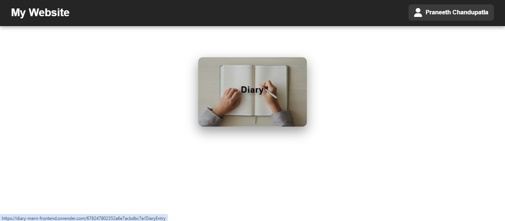
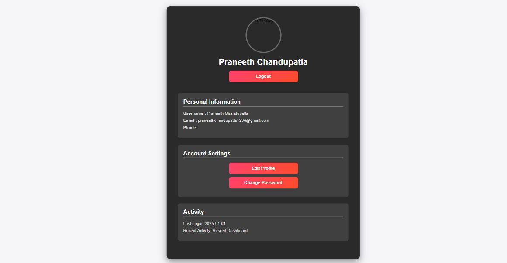
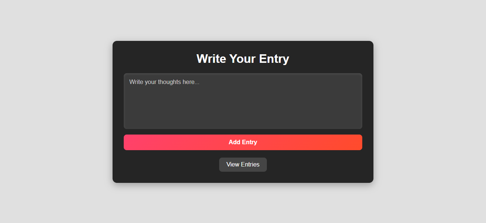
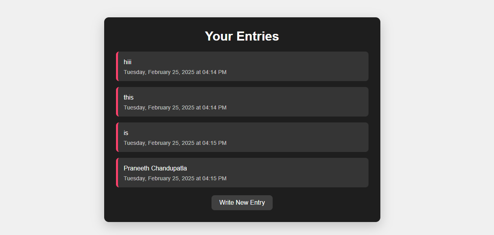
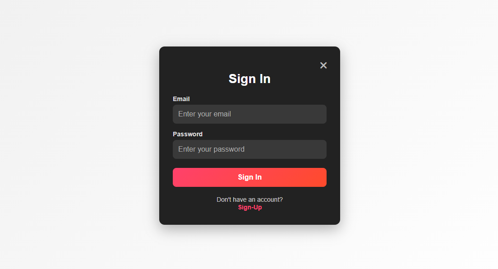
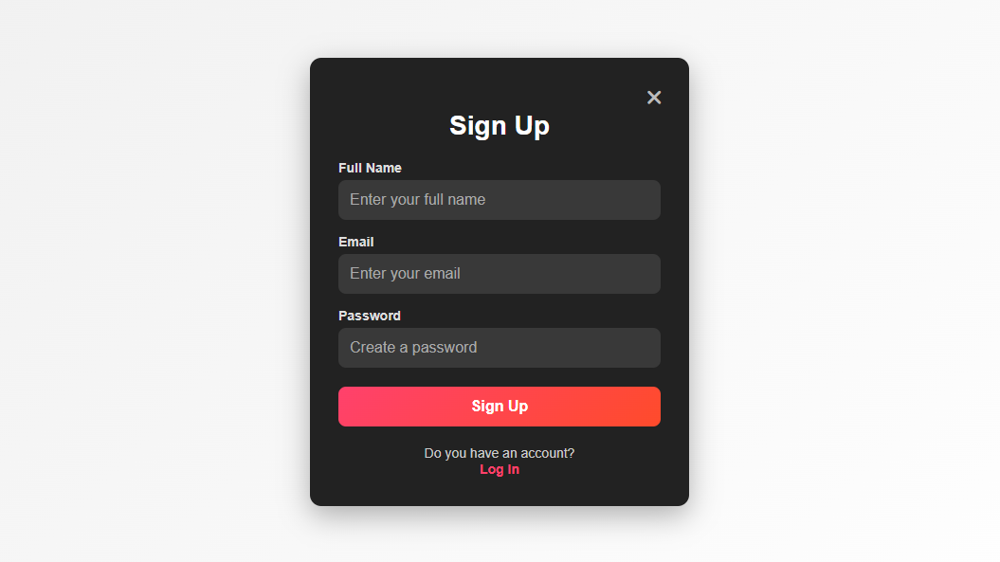

# 📖 Diary MERN  

## 📌 Project Description  
Diary MERN is a **MERN stack** application that allows users to **write and manage diary entries**. It provides a simple and responsive interface to add, edit, and delete diary entries securely. The project is built using **React** for the frontend, **Node.js & Express.js** for the backend, and **MongoDB** as the database.

## ✨ Features  
- **User Authentication** – Secure login/signup with JWT authentication  
- **CRUD Operations** – Create and read  diary entries  
- **Responsive UI** – Works across all devices  
- **Data Persistence** – Stores diary entries in MongoDB

## 🚀 Live Demo  
Check out the live version of the project:  
🔗 **[Diary Website](https://diary-mern-frontend.onrender.com/)**  

---

## 🏗️ Folder Structure  
```bash
/Diary-MERN
├── /frontend
│   ├── /public
│   ├── /src
│   │   ├── /components
│   │   ├── /pages
│   │   ├── App.js
│   │   ├── index.js
│   ├── package.json
│   ├── vite.config.js
├── /backend
│   ├── /config
│   ├── /controllers
│   ├── /middlewares
│   ├── /models
│   ├── /routes
│   ├── server.js
│   ├── package.json
├── .gitignore
├── README.md

```

## 📸 Screenshots  

<p align="center">
  
  
</p>

<p align="center">
  
  
</p>
<p align="center">
  
  
</p>


## 🛠️ Technologies Used

- Frontend: React, vite

- Backend: Node.js, Express.js, MongoDB

- Authentication: JWT (JSON Web Tokens), bcrypt.js

- Database Management: Mongoose
